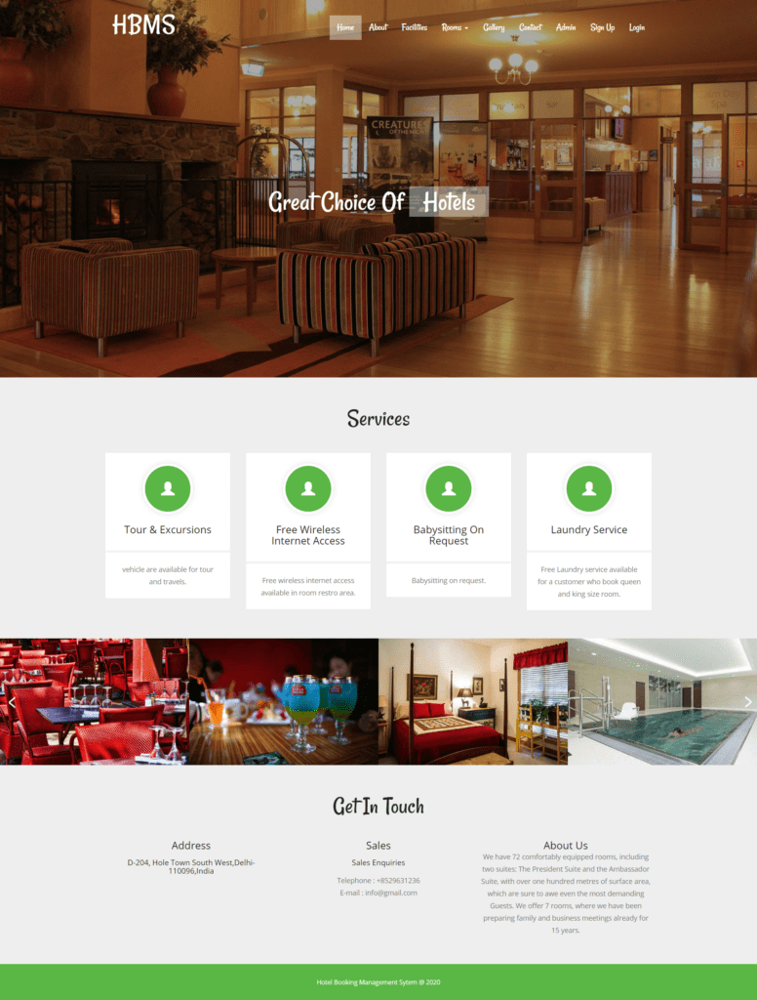
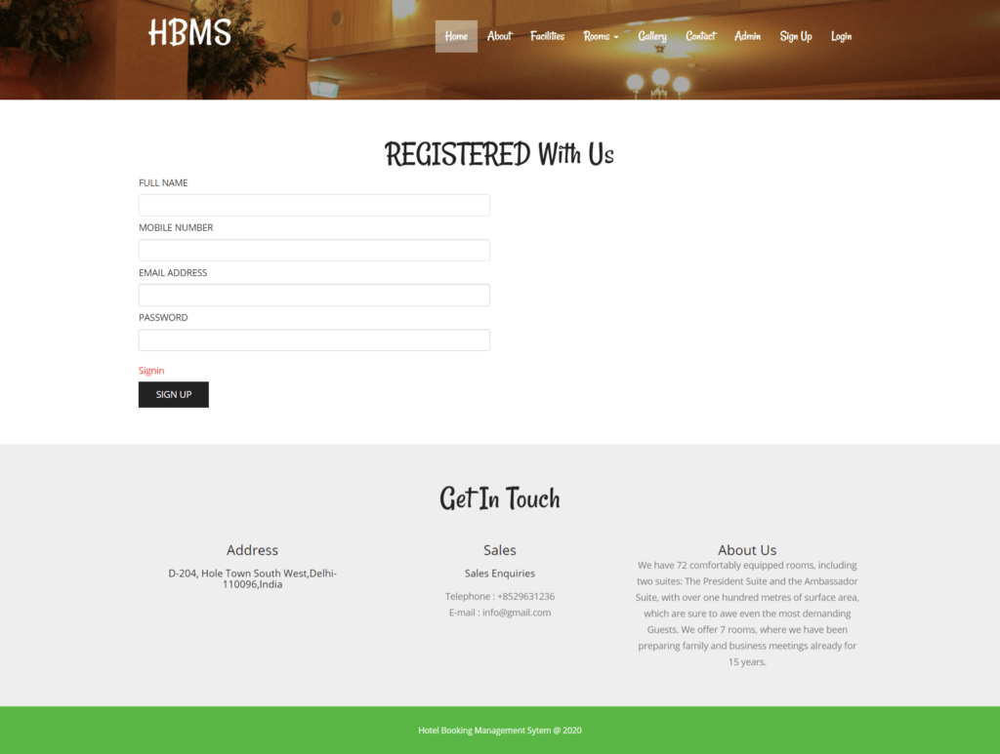
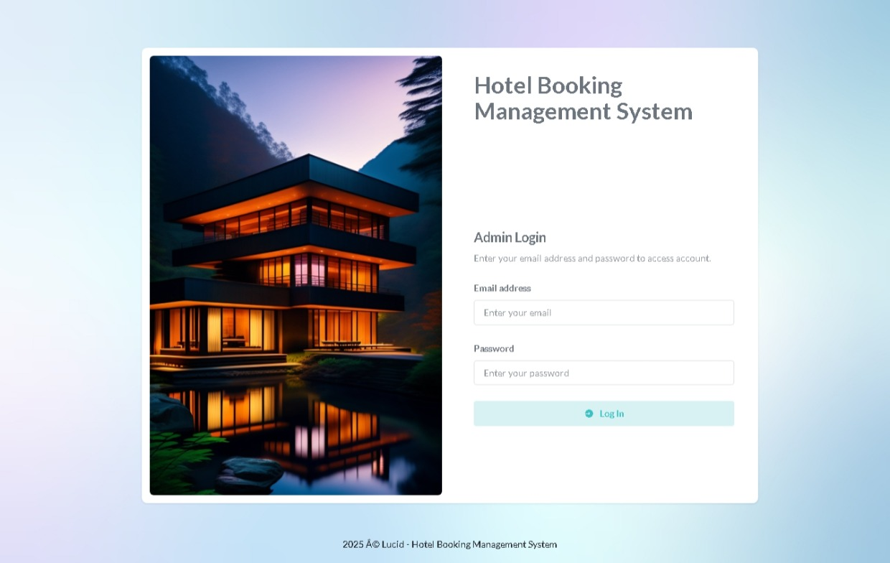
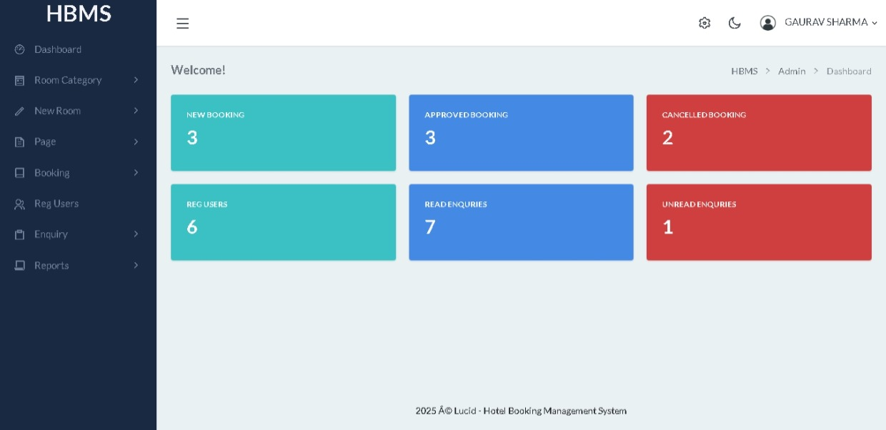

# Hotel Booking Management System Using ColdBox and MySQL
The **Hotel Booking Management System** is a web application designed to simplify and streamline hotel room reservations and management processes. This application overcomes the limitations of traditional manual systems, offering efficiency, data integrity, and ease of use. It is built using **ColdBox**, a powerful and modular MVC framework for ColdFusion (CFML), and leverages a MySQL database for data storage.

## 🌐 Project Overview
This system includes two major modules: **Admin** and **User**. It allows hotel staff to manage room categories, bookings, customer inquiries, and content pages. Users can register, view room listings, make bookings, and manage their own profiles.

## 🚀 Tech Stack
| Requirement          | Details                                      |
|----------------------|----------------------------------------------|
| **Project Name**     | Hotel Booking Management System in ColdBox   |
| **Framework**        | [ColdBox Platform](https://coldbox.org) (v6+) |
| **Language Used**    | Adobe ColdFusion (CFML)                            |
| **Database**         | MySQL 5.x                                    |
| **Frontend**         | HTML, AJAX, jQuery, JavaScript               |
| **Web Browsers**     | Chrome, Firefox, Edge, Opera                 |
| **Software Needed**  | CommandBox, MySQL, Adobe ColdFusion    |

In the Hotel Booking Management System we use the ColdBox MVC Framework and a MySQL Database. This project keeps records of bookings, clients, and hotel services. The Hotel Booking Management System has two modules: admin and user.

## Admin Module

1. **Home:** In this section, the admin can briefly view the total new bookings, approved bookings, cancelled bookings, total registered users, total read enquiries, and total unread enquiries.
2. **Room Category:** In this section, the admin can manage the room categories (add/delete).
3. **New Room:** In this section, the admin can manage rooms (add/update).
4. **Page:** In this section, the admin can manage the "About Us" and "Contact Us" pages.
5. **Booking:** In this section, the admin can view new, approved, and cancelled bookings and also give remarks.
6. **Reg Users:** In this section, the admin can view details of registered users.
7. **Enquiry:** In this section, the admin can view and maintain enquiries.
8. **Search:** In this section, the admin can search enquiry and booking details with the help of a mobile number or booking number.
9. **Reports:** In this section, the admin can view enquiry details and check booking details within a specific period.

The admin can also update their profile, change the password, and recover the password.

## User Module

1. **Home:** This is the welcome page for users.
2. **About:** This is the "About Us" page of the website.
3. **Services:** In this section, users can view services provided by the organization.
4. **Room:** In this section, users can view details of available rooms in the hotel.
5. **Gallery:** In this section, users can view the gallery of the hotel.
6. **Book Room:** In this section, users can book a hotel room after registering.
7. **Contact:** This is the "Contact Us" page where users can send queries to the hotel.
8. **Sign Up:** Users can register through the sign-up page.
9. **Login:** This is the login page.
10. **My Account:** After registration, users can have their own account where they can update their profile, change their password, recover their password, and view booking details of their hotel room.

## Some Project Screenshots

### Home Page

### Register Page

### Admin Login

### Admin Dashboard

## Contributing
Feel free to fork this repository and submit pull requests for improvements or additional features.

## Contact
Created by Gaurav — [LinkedIn](https://linkedin.com/in/gaurav110601)
